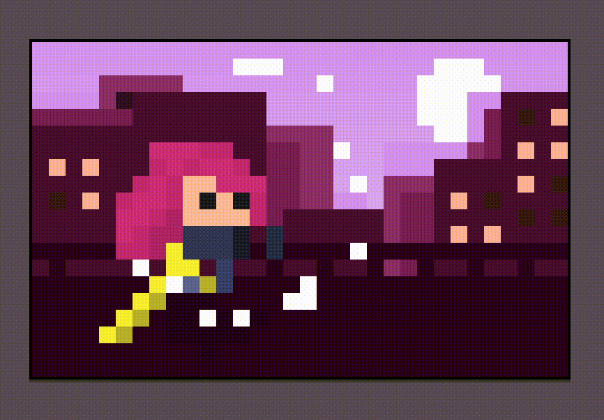

  

<h1 align="center">✨ hi, i am esma</h1>

<em>i am passionate about learning new things, supporting <b>open source projects</b>, and diving into <b>web design</b></em>

  
  
  
  
  
  
  
  
  
  
  

  check out my website for more 
  <a href="https://www.esmaoruc.com/">esmaoruc.com</a> <em>(to be updated soon)</em>

<h1 align="center">connect with me</h1>

  

  

